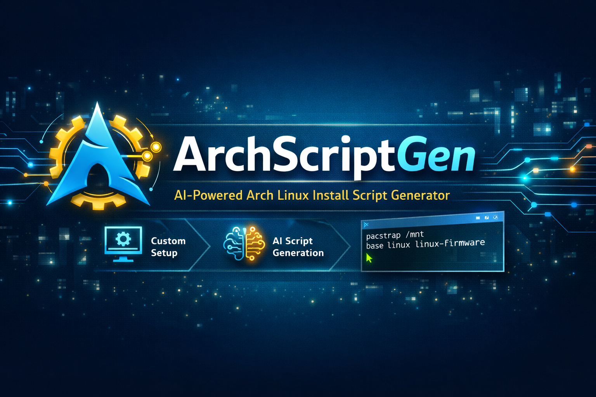

# 🚀 ArchScriptGen


---

## 💡 About

**ArchScriptGen** is a GUI-based tool that helps you generate complete Arch Linux installation and configuration scripts using AI.

Built with **PyQt6 + Groq API**, it simplifies the complex Arch setup process into an intuitive visual workflow.

---

## ✨ Features

* 🖥️ Modern GUI built with PyQt6
* 🤖 AI-powered script generation (Groq - LLaMA 3.3)
* 🎨 Theme selection with live preview
* 🧩 Desktop Environment chooser (GNOME, KDE, i3, XFCE, etc.)
* 📦 Search and install apps from Arch repositories
* 🖱️ Cursor theme selection
* ⚙️ Advanced system configuration:

  * Bootloader selection
  * Kernel selection
  * User & hostname setup
  * Network & drivers
* 🌐 Wallpaper & dotfiles integration
* 💾 Export scripts as `.sh` files

---

## 🚀 Quick Start

1. Download the latest version from **Releases**
2. Extract the `.zip` file
3. Open the folder
4. Run:

```bash
ArchScriptGen.exe
```

5. Enter your Groq API key when prompted
6. Start generating your Arch install script

---

## 🔑 API Key Setup

This app uses the **Groq API** for AI script generation.

Get your free API key here:
👉 https://console.groq.com/keys

✔ Stored locally on your machine
✔ Never uploaded or shared

---

## ⚠️ Requirements

* Windows OS
* Internet connection (required for API + package search)

---

## 🧠 How It Works

1. Select your system preferences (DE, apps, drivers, etc.)
2. The app sends your request to Groq AI
3. AI generates a complete Arch Linux bash script
4. You can review and export it

---

## ⚠️ Disclaimer

* This tool **generates scripts only** — it does NOT install Arch Linux directly
* Always review generated scripts before running them
* Use at your own risk

---

## ✨ Features Overview

| Feature              | Status |
| -------------------- | ------ |
| GUI Interface        | ✅      |
| AI Script Generation | ✅      |
| App Installer        | ✅      |
| Theme Preview        | ✅      |
| Cursor Selection     | ✅      |
| Full Auto Installer  | 🚧     |
| ISO Builder          | 🚧     |

---

## 📁 Project Structure

```
project/
├── main.py
├── themes/
├── cursors/
├── DesktopEnvironment/
├── README.md
└── LICENSE
```

---

## 🛠️ Tech Stack

* Python
* PyQt6
* Groq API
* Requests
* PyInstaller

---

## 🐞 Known Issues

* First launch may be slow (PyInstaller extraction behavior)
* Large executable size due to PyQt6 bundling

---

## 🚀 Future Plans

* Full automated Arch installer scripts
* Disk partitioning UI
* Arch ISO builder integration (archiso)
* Plugin system for custom configs
* Performance optimizations

---

## 🤝 Contributing

Contributions are welcome!

* Open an issue
* Submit a pull request
* Suggest new features

---

## ⭐ Support

If you like this project:

👉 Give it a star ⭐ on GitHub

---

## 📜 License

This project is licensed under the **MIT License**.

---
